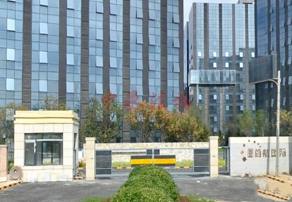
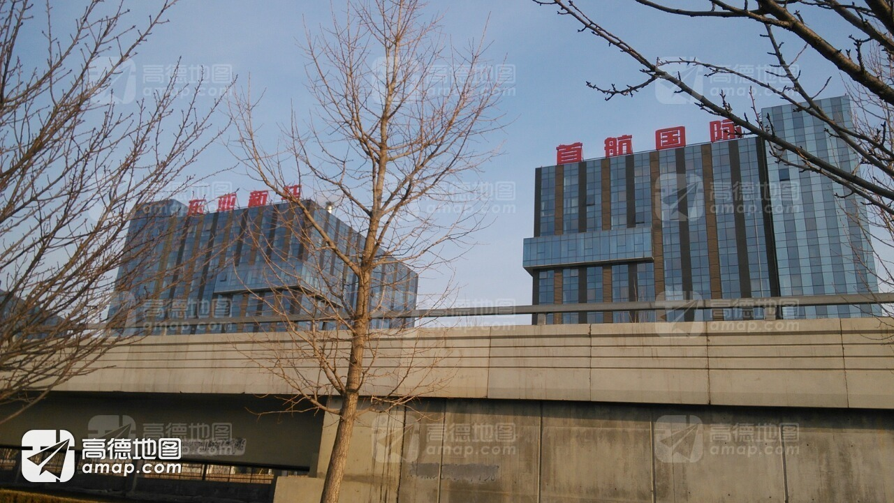
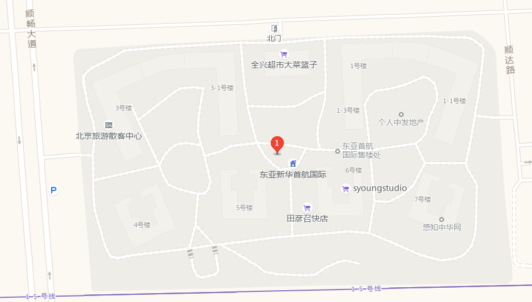
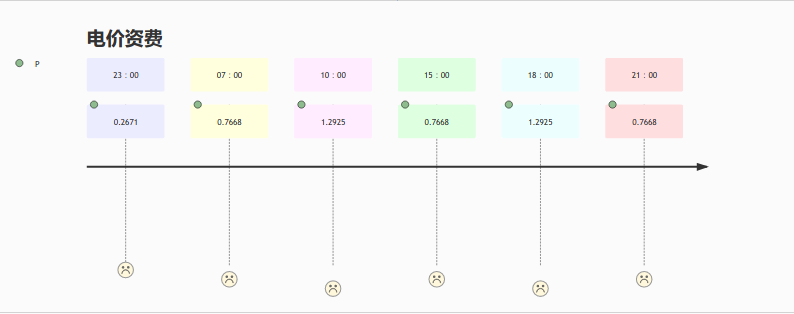

# LifeTips   

# 北上广求生指北 🧭

## 基础篇 | Basic articles

+ **[东亚首航国际](https://ditu.amap.com/place/B000AA1H66)**
   
  *[详情介绍](https://ditu.amap.com/detail/B000AA1H66?citycode=110000)*

    

  

    - *小区信息*  
      🪙物业费：2.68元/月/平方米  
      🚧建筑类型：塔楼/塔板结合  
      👔开发商：北京东亚新华投资有限公司  
      👨‍💼物业公司：北京东亚时代物业管理有限公司 

    

    *电价资费*
    
      * 23:00-07:00 谷 0.2671  
      * 07:00-10:00 平 0.7668  
      * 10:00-15:00 峰 1.2925  
      * 15:00-18:00 平 0.7668  
      * 18:00-21:00 峰 1.2925  
      * 21:00-23:00 平 0.7668  

    

    *7月-8月*

      * 23:00-07:00 谷  
      * 07:00-10:00 平  
      * 10:00-11:00 峰  
      * 11:00-13:00 尖峰  
      * 13:00-15:00 峰  
      * 15:00-16:00 平  
      * 16:00-17:00 尖峰  
      * 17:00-18:00 平  
      * 18:00-21:00 峰  
      * 21:00-23:00 平  

    - *小区服务*

      **👮南法信派出所**  
      ☎️电话: 010-69473379  
      🏢地址: 南法信府前街43号  

      **🏠街道办**  
      🏤南法信镇人民政府  
      ️☎️电话010-69471104  
      🏢地址南法信府前街  

      **🏪超市便利店**

        * *[全兴超市大菜篮子(首航国际店)](https://ditu.amap.com/place/B0FFGSSS4Q)*  
          北门-楼地商

        * *便利店*  
          3-3

        * *在楼下自动贩卖机*  
          5号楼东侧

      **🍳餐厅饭馆**

        * *晋香缘面馆*  
          北门-楼地商

        * *麻辣烫*  
          北门-楼地商

        * *电烤串*  
          北门-楼地商

      **👶其他服务**

        * *理发店*  
          5-107

        * *物业*  
          3-3 地下一层

    
    - *附近的地点*

      * 🚌*公交地铁*

        * *[物流园东(公交站)](https://ditu.amap.com/place/BV10009922)  160.09米*  
          顺27路(东府市场--国家会计学院)  
          顺43路(蓝岸丽舍--羊房)  

        * *[刘家河北(公交站)](https://ditu.amap.com/place/BV10009921)  464.25米*  
          顺27路(东府市场--国家会计学院)  
          顺43路(蓝岸丽舍--羊房)  

        * *[物流园西(公交站)](https://ditu.amap.com/place/BV10009923)  892.21米*  
          顺27路(东府市场--国家会计学院)  
          顺43路(蓝岸丽舍--羊房)  
        
        * *[地铁南法信站(公交站)](https://ditu.amap.com/place/BV10009937)  948.27米*  
          顺27路(东府市场--国家会计学院)  
          顺43路(蓝岸丽舍--羊房)  
      
      * 🅿️*停车场*

        * *[首航国际停车场](https://ditu.amap.com/place/B0FFGJRFN0) 90.64米*  
          顺达路西200米

        * *[停车场(顺畅大道)](https://ditu.amap.com/place/B0FFGJRFMR)  184.75米*  
          顺于路与顺畅大道交叉口北150米

        * *[国家电网北京顺义供电公司停车场](https://ditu.amap.com/place/B0FFHQ7SG6)  248.87米*  
          顺达路6号1栋附近

        * *[天博中心停车场](https://ditu.amap.com/place/B0FFFYIWXV)  949.94米*  
          南法信镇顺于路与南焦路交汇处天博中心

        * *[地上停车场](https://ditu.amap.com/place/B0FFGGUQVX)  991.97米*  
          物流园八街与顺畅大道交叉口东150米

      * ⛽*加油站*

        * *[中图能源京新加油站](https://ditu.amap.com/place/B0FFH692JJ)  1753.96米*  
          西杜兰村京密路西侧

        * *[中国石化海洪加油站](https://ditu.amap.com/place/B000A83ISV)  1852.0米*
          南法信地区西海洪村西

        * *[顺腾信石油加油站](https://ditu.amap.com/place/B0FFHNAH8G)  2160.2米*
          顺平路14号附近

        * *[中国石化华京顺加油站](https://ditu.amap.com/place/B000A95C9M)  2273.0米*
          南法信顺平路望泉桥西侧路北100米

        * *[中国石油北京国门阳光加油站](https://ditu.amap.com/place/B000A8XRPG) 2459.0米*  
          六环望泉桥西南角

## 👍 鸣谢 | Thanks

***部分数据来源自高德地图&大众点评***

***🗺️[高德地图](https://ditu.amap.com/)***  
***😋[大众点评](https://www.dianping.com/)***